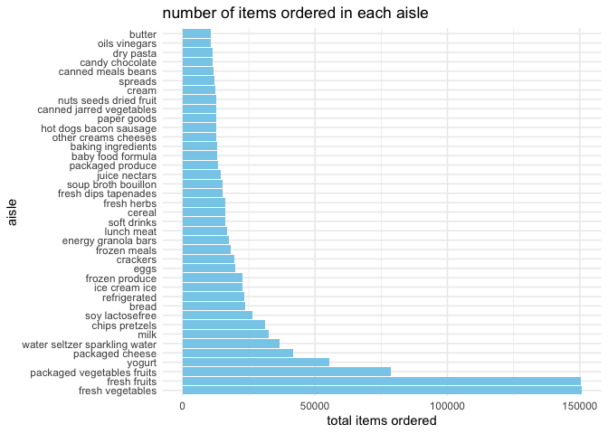
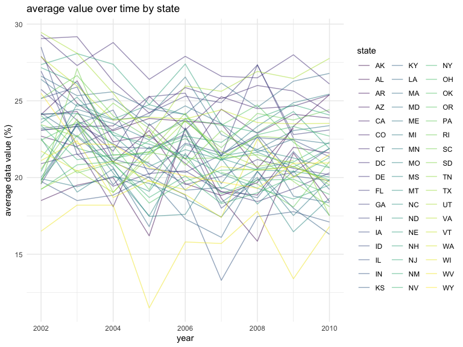
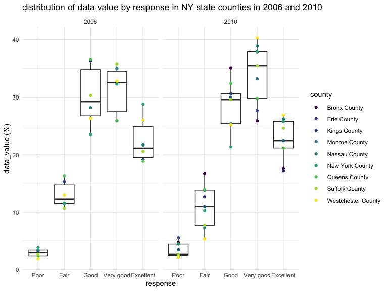

hw3_nn2477
================
Nhu Nguyen
2023-10-11

``` r
library(tidyverse)
library(ggplot2)
library(p8105.datasets)
data("instacart")
```

## getting the number of unique aisles

``` r
instacart %>% 
  summarise(count = n_distinct(aisle))
```

    ## # A tibble: 1 × 1
    ##   count
    ##   <int>
    ## 1   134

## getting the aisles with the most item ordered

``` r
instacart %>% 
  group_by(aisle) %>% 
  summarise(total_items = n()) %>% 
  arrange(desc(total_items))
```

    ## # A tibble: 134 × 2
    ##    aisle                         total_items
    ##    <chr>                               <int>
    ##  1 fresh vegetables                   150609
    ##  2 fresh fruits                       150473
    ##  3 packaged vegetables fruits          78493
    ##  4 yogurt                              55240
    ##  5 packaged cheese                     41699
    ##  6 water seltzer sparkling water       36617
    ##  7 milk                                32644
    ##  8 chips pretzels                      31269
    ##  9 soy lactosefree                     26240
    ## 10 bread                               23635
    ## # ℹ 124 more rows

## making plot for aisle and number of items ordered

``` r
instacart %>% 
  group_by(aisle) %>% 
  summarise(total_items = n()) %>% 
  filter(total_items > 10000) %>% 
  arrange(desc(total_items)) %>% 
ggplot(aes(x = reorder(aisle, -total_items), y = total_items)) +
  geom_point() + 
  labs (
    title = "number of items ordered in each aisle", 
    x = "aisle",
    y = "total items ordered"
  ) + 
  coord_flip() + 
  theme_minimal()
```



## making a table for the three most popular items

``` r
instacart %>% 
  filter(aisle %in% c("baking ingredients", "dog food care", "packaged vegetables fruits")) %>% 
  group_by(aisle, product_name) %>% 
  summarise(order_count = n()) %>% 
  arrange(aisle, desc(order_count)) %>% 
  group_by(aisle) %>% 
  slice_max(order_count, n = 3) %>% 
  pivot_wider(
    names_from = aisle,
    values_from = order_count)
```

    ## `summarise()` has grouped output by 'aisle'. You can override using the
    ## `.groups` argument.

    ## # A tibble: 9 × 4
    ##   product_name       `baking ingredients` `dog food care` packaged vegetables …¹
    ##   <chr>                             <int>           <int>                  <int>
    ## 1 Light Brown Sugar                   499              NA                     NA
    ## 2 Pure Baking Soda                    387              NA                     NA
    ## 3 Cane Sugar                          336              NA                     NA
    ## 4 Snack Sticks Chic…                   NA              30                     NA
    ## 5 Organix Chicken &…                   NA              28                     NA
    ## 6 Small Dog Biscuits                   NA              26                     NA
    ## 7 Organic Baby Spin…                   NA              NA                   9784
    ## 8 Organic Raspberri…                   NA              NA                   5546
    ## 9 Organic Blueberri…                   NA              NA                   4966
    ## # ℹ abbreviated name: ¹​`packaged vegetables fruits`

## create table for pink landy apples and coffee ice cream

``` r
instacart %>% 
  mutate(order_dow = recode(
    order_dow,
    "0" = "sunday",
    "1" = "monday",
    "2" = "tuesday",
    "3" = "wednesday",
    "4" = "thursday",
    "5" = "friday",
    "6" = "saturday")) %>% 
  filter(product_name %in% c("Pink Lady Apples", "Coffee Ice Cream")) %>% 
  group_by(order_dow, product_name) %>% 
  summarise(mean_hour = mean(order_hour_of_day, na.rm = TRUE)) 
```

    ## `summarise()` has grouped output by 'order_dow'. You can override using the
    ## `.groups` argument.

    ## # A tibble: 14 × 3
    ## # Groups:   order_dow [7]
    ##    order_dow product_name     mean_hour
    ##    <chr>     <chr>                <dbl>
    ##  1 friday    Coffee Ice Cream      12.3
    ##  2 friday    Pink Lady Apples      12.8
    ##  3 monday    Coffee Ice Cream      14.3
    ##  4 monday    Pink Lady Apples      11.4
    ##  5 saturday  Coffee Ice Cream      13.8
    ##  6 saturday  Pink Lady Apples      11.9
    ##  7 sunday    Coffee Ice Cream      13.8
    ##  8 sunday    Pink Lady Apples      13.4
    ##  9 thursday  Coffee Ice Cream      15.2
    ## 10 thursday  Pink Lady Apples      11.6
    ## 11 tuesday   Coffee Ice Cream      15.4
    ## 12 tuesday   Pink Lady Apples      11.7
    ## 13 wednesday Coffee Ice Cream      15.3
    ## 14 wednesday Pink Lady Apples      14.2

## problem 2

loading dataset

``` r
data("brfss_smart2010")
```

## cleaning dataset

``` r
brfss_df <- brfss_smart2010 %>% 
  janitor::clean_names() %>% 
  rename(county = locationdesc, state = locationabbr) %>% 
  filter(topic == "Overall Health",
     response %in% c("Excellent", "Very good", "Good", "Fair", "Poor")) %>% 
  mutate(response = factor(
    response,
    levels = c("Poor", "Fair", "Good", "Very good", "Excellent"), exclude = NULL),
    county = gsub("-", "", as.character(county)),
    county = substring(county, first = 4))
```

## 2002 data

``` r
brfss_2002 <- brfss_df %>% 
  filter(year == 2002) %>% 
  group_by(state) %>% 
  summarise(locations = n()) %>% 
  filter(locations >= 7) 
```

In 2002,AZ, CO, CT, DE, FL, GA, HI, ID, IL, IN, KS, LA, MA, MD, ME, MI,
MN, MO, NC, NE, NH, NJ, NV, NY, OH, OK, OR, PA, RI, SC, SD, TN, TX, UT,
VT, WA were observed to have 7 or more locations.

## 2010 data

``` r
brfss_2010 <- brfss_df %>% 
  filter(year == 2010) %>% 
  group_by(state) %>% 
  summarise(locations = n()) %>% 
  filter(locations >= 7) 
```

In 2010,AL, AR, AZ, CA, CO, CT, DE, FL, GA, HI, IA, ID, IL, IN, KS, LA,
MA, MD, ME, MI, MN, MO, MS, MT, NC, ND, NE, NH, NJ, NM, NV, NY, OH, OK,
OR, PA, RI, SC, SD, TN, TX, UT, VT, WA, WY were observed to have 7 or
more locations.

``` r
brfss_excellent <- brfss_df %>% 
  filter(response == "Excellent") %>% 
  group_by(year, state) %>% 
  summarise (mean_data_value = mean(data_value))
```

    ## `summarise()` has grouped output by 'year'. You can override using the
    ## `.groups` argument.

``` r
  ggplot(brfss_excellent, aes(x = year, y = mean_data_value, group = state, color = state)) +
  geom_line(alpha = .5) +
  labs(
    title = "average value over time by state",
    x = "year",
    y = "average data value (%)"
  ) + 
    theme_minimal()
```



## making two panel plot for NYC data

``` r
brfss_ny_df = brfss_df %>% 
  filter(year %in% c("2006", "2010"),
         state == "NY",
         response %in% c("Poor", "Fair", "Good", "Very good", "Excellent")) 

brfss_ny_df %>% 
  ggplot(aes(x = response, y = data_value)) + 
  geom_boxplot() +
  geom_point(aes(color = county)) +
  facet_grid(. ~ year) +
  labs(
    title = "distribution of data value by response in NY state counties in 2006 and 2010",
    x = "response", 
    y = "data_value (%)",
    color = "county"
  ) + 
  theme_minimal()
```



## problem 3
