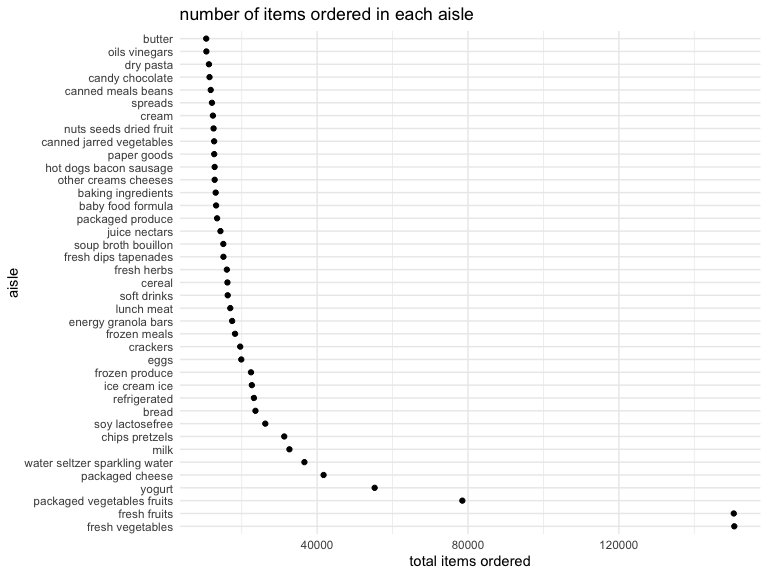
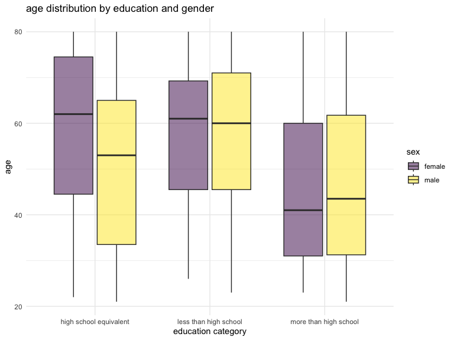
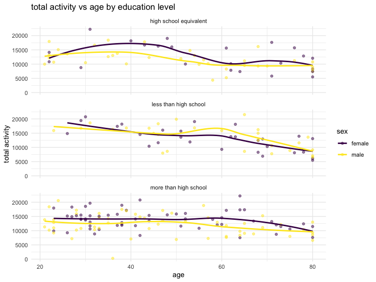
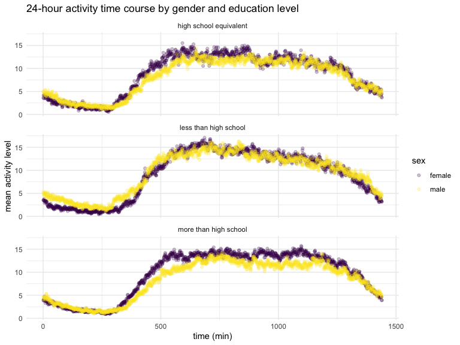

hw3_nn2477
================
Nhu Nguyen
2023-10-11

## problem 1

``` r
data("instacart")
instacart %>% 
  summarise(count = n_distinct(aisle))
```

    ## # A tibble: 1 × 1
    ##   count
    ##   <int>
    ## 1   134

## getting the aisles with the most item ordered

``` r
instacart %>% 
  group_by(aisle) %>% 
  summarise(total_items = n()) %>% 
  arrange(desc(total_items))
```

    ## # A tibble: 134 × 2
    ##    aisle                         total_items
    ##    <chr>                               <int>
    ##  1 fresh vegetables                   150609
    ##  2 fresh fruits                       150473
    ##  3 packaged vegetables fruits          78493
    ##  4 yogurt                              55240
    ##  5 packaged cheese                     41699
    ##  6 water seltzer sparkling water       36617
    ##  7 milk                                32644
    ##  8 chips pretzels                      31269
    ##  9 soy lactosefree                     26240
    ## 10 bread                               23635
    ## # ℹ 124 more rows

## making plot for aisle and number of items ordered

``` r
instacart %>% 
  group_by(aisle) %>% 
  summarise(total_items = n()) %>% 
  filter(total_items > 10000) %>% 
  arrange(desc(total_items)) %>% 
ggplot(aes(x = reorder(aisle, -total_items), y = total_items)) +
  geom_point() + 
  labs (
    title = "number of items ordered in each aisle", 
    x = "aisle",
    y = "total items ordered"
  ) + 
  coord_flip() + 
  theme_minimal()
```



## making a table for the three most popular items

``` r
instacart %>% 
  filter(aisle %in% c("baking ingredients", "dog food care", "packaged vegetables fruits")) %>% 
  group_by(aisle, product_name) %>% 
  summarise(order_count = n()) %>% 
  arrange(aisle, desc(order_count)) %>% 
  group_by(aisle) %>% 
  slice_max(order_count, n = 3) %>% 
  pivot_wider(
    names_from = aisle,
    values_from = order_count)
```

    ## `summarise()` has grouped output by 'aisle'. You can override using the
    ## `.groups` argument.

    ## # A tibble: 9 × 4
    ##   product_name       `baking ingredients` `dog food care` packaged vegetables …¹
    ##   <chr>                             <int>           <int>                  <int>
    ## 1 Light Brown Sugar                   499              NA                     NA
    ## 2 Pure Baking Soda                    387              NA                     NA
    ## 3 Cane Sugar                          336              NA                     NA
    ## 4 Snack Sticks Chic…                   NA              30                     NA
    ## 5 Organix Chicken &…                   NA              28                     NA
    ## 6 Small Dog Biscuits                   NA              26                     NA
    ## 7 Organic Baby Spin…                   NA              NA                   9784
    ## 8 Organic Raspberri…                   NA              NA                   5546
    ## 9 Organic Blueberri…                   NA              NA                   4966
    ## # ℹ abbreviated name: ¹​`packaged vegetables fruits`

## create table for pink landy apples and coffee ice cream

``` r
instacart %>% 
  mutate(order_dow = recode(
    order_dow,
    "0" = "sunday",
    "1" = "monday",
    "2" = "tuesday",
    "3" = "wednesday",
    "4" = "thursday",
    "5" = "friday",
    "6" = "saturday")) %>% 
  filter(product_name %in% c("Pink Lady Apples", "Coffee Ice Cream")) %>% 
  group_by(order_dow, product_name) %>% 
  summarise(mean_hour = mean(order_hour_of_day, na.rm = TRUE)) 
```

    ## `summarise()` has grouped output by 'order_dow'. You can override using the
    ## `.groups` argument.

    ## # A tibble: 14 × 3
    ## # Groups:   order_dow [7]
    ##    order_dow product_name     mean_hour
    ##    <chr>     <chr>                <dbl>
    ##  1 friday    Coffee Ice Cream      12.3
    ##  2 friday    Pink Lady Apples      12.8
    ##  3 monday    Coffee Ice Cream      14.3
    ##  4 monday    Pink Lady Apples      11.4
    ##  5 saturday  Coffee Ice Cream      13.8
    ##  6 saturday  Pink Lady Apples      11.9
    ##  7 sunday    Coffee Ice Cream      13.8
    ##  8 sunday    Pink Lady Apples      13.4
    ##  9 thursday  Coffee Ice Cream      15.2
    ## 10 thursday  Pink Lady Apples      11.6
    ## 11 tuesday   Coffee Ice Cream      15.4
    ## 12 tuesday   Pink Lady Apples      11.7
    ## 13 wednesday Coffee Ice Cream      15.3
    ## 14 wednesday Pink Lady Apples      14.2

## problem 2

loading dataset

``` r
data("brfss_smart2010")
```

## cleaning dataset

``` r
brfss_df <- brfss_smart2010 %>% 
  janitor::clean_names() %>% 
  rename(county = locationdesc, state = locationabbr) %>% 
  filter(topic == "Overall Health",
     response %in% c("Excellent", "Very good", "Good", "Fair", "Poor")) %>% 
  mutate(response = factor(
    response,
    levels = c("Poor", "Fair", "Good", "Very good", "Excellent"), exclude = NULL),
    county = gsub("-", "", as.character(county)),
    county = substring(county, first = 4))
```

## 2002 data

``` r
brfss_2002 <- brfss_df %>% 
  filter(year == 2002) %>% 
  group_by(state) %>% 
  summarise(locations = n()) %>% 
  filter(locations >= 7) 
```

In 2002,AZ, CO, CT, DE, FL, GA, HI, ID, IL, IN, KS, LA, MA, MD, ME, MI,
MN, MO, NC, NE, NH, NJ, NV, NY, OH, OK, OR, PA, RI, SC, SD, TN, TX, UT,
VT, WA were observed to have 7 or more locations.

## 2010 data

``` r
brfss_2010 <- brfss_df %>% 
  filter(year == 2010) %>% 
  group_by(state) %>% 
  summarise(locations = n()) %>% 
  filter(locations >= 7) 
```

In 2010,AL, AR, AZ, CA, CO, CT, DE, FL, GA, HI, IA, ID, IL, IN, KS, LA,
MA, MD, ME, MI, MN, MO, MS, MT, NC, ND, NE, NH, NJ, NM, NV, NY, OH, OK,
OR, PA, RI, SC, SD, TN, TX, UT, VT, WA, WY were observed to have 7 or
more locations.

``` r
brfss_excellent <- brfss_df %>% 
  filter(response == "Excellent") %>% 
  group_by(year, state) %>% 
  summarise (mean_data_value = mean(data_value))
```

    ## `summarise()` has grouped output by 'year'. You can override using the
    ## `.groups` argument.

This data set has 443 observations that responded “Excellent” when asked
about their general health

``` r
ggplot(brfss_excellent, aes(x = year, y = mean_data_value, group = state, color = state)) +
  geom_line(alpha = .5) +
  labs(
    title = "average value over time by state",
    x = "year",
    y = "average data value (%)"
  ) + 
    theme_minimal()
```


this “spaghetti” plot shows a general trend of data value points
decreasing over time for each state. the average data value ranges from
17.5 to 27.5 capturing most points, however some average data values do
fall outside this range. specifically, WV appears to be a visual outlier
in this plot.

## making two panel plot for NYC data

``` r
brfss_ny_df = brfss_df %>% 
  filter(year %in% c("2006", "2010"),
         state == "NY",
         response %in% c("Poor", "Fair", "Good", "Very good", "Excellent")) 

brfss_ny_df %>% 
  ggplot(aes(x = response, y = data_value)) + 
  geom_boxplot() +
  geom_point(aes(color = county)) +
  facet_grid(. ~ year) +
  labs(
    title = "distribution of data value by response in NY state counties in 2006 and 2010",
    x = "response", 
    y = "data_value (%)",
    color = "county"
  ) + 
  theme_minimal()
```


For both 2006 and 2010, the response “good” and “very good” has the
highest data values while the response “poor” had the lowest data value.

## problem 3

cleaning, tidying, merging datasets

``` r
accel_df =
  read.csv("./data/nhanes_accel.csv") %>% 
  janitor::clean_names() 

covar_df = 
  read_csv("./data/nhanes_covar.csv", skip = 4) %>%
  janitor::clean_names() %>% 
  filter(age >= 21) %>% 
  mutate(sex = recode(
    sex, `1` = "male", `2` = "female"),
    education = recode(
      education, `1` = "less than high school", `2` = "high school equivalent", `3` = "more than high school"
    ),
    sex = factor(sex), 
    education = factor(education)) %>% 
  drop_na()
```

    ## Rows: 250 Columns: 5
    ## ── Column specification ────────────────────────────────────────────────────────
    ## Delimiter: ","
    ## dbl (5): SEQN, sex, age, BMI, education
    ## 
    ## ℹ Use `spec()` to retrieve the full column specification for this data.
    ## ℹ Specify the column types or set `show_col_types = FALSE` to quiet this message.

``` r
mims_df = left_join(covar_df, accel_df, by = "seqn")
```

men/women by education and age distribution

``` r
education_mims_df <- mims_df %>% 
  group_by (sex, education) %>% 
  summarise(count = n()) %>% 
  pivot_wider(
    names_from = sex,
    values_from = count)
```

    ## `summarise()` has grouped output by 'sex'. You can override using the `.groups`
    ## argument.

``` r
knitr::kable(education_mims_df, caption = "# of men and women in each education category")
```

| education              | female | male |
|:-----------------------|-------:|-----:|
| high school equivalent |     23 |   35 |
| less than high school  |     28 |   27 |
| more than high school  |     59 |   56 |

\# of men and women in each education category

the highest education both genders received was in the “more than high
school” category.

``` r
ggplot(mims_df, aes(x = education, y = age, fill = sex)) + 
  geom_boxplot(alpha = .5) + 
  labs(
    title = "age distribution by education and gender",
    x = "education category",
    y = "age"
  ) + theme_minimal()
```



females, on average, appeared to be older in the “high school
equivalent” category, whereas males, on average, appeared to be older in
the “less than high school” and “more than high school” education
category.

## total activity over day plot

aggregating min variable

``` r
total_activity_df <- mims_df %>% 
  mutate(
    total_activity = rowSums(across(c(min1:min1440)))
  )
```

creating plots:

``` r
ggplot(total_activity_df, aes(x = age, y = total_activity, color = sex)) +
  geom_point(alpha = .5) + 
  facet_wrap(~education, ncol = 1) + 
  geom_smooth(se = FALSE)+
  labs(
    title = "total activity vs age by education level", 
    x = "age",
    y = "total activity"
  ) + 
  theme_minimal()
```

    ## `geom_smooth()` using method = 'loess' and formula = 'y ~ x'



in all 3 education categories, on average, the total physical activity
for both genders tend to decrease with overall age. for both “high
school equivalent” and “more than high school” education category, women
tend to be more active compared to their male counterparts (as seen in
the trend lines). the greatest decline in trend line for both genders is
in the “less than high school” education category.

## activity over day plot

``` r
time_course_data <- total_activity_df %>% 
  group_by(education, sex) %>% 
  summarise(across(starts_with("min"), ~mean(.), .names = "mean_{.col}")) %>% 
  pivot_longer(
    cols = starts_with("mean"),
    names_to = "time",
    values_to = "mean") %>% 
  mutate(time = substring(time, 9),
         time = as.numeric(time))
```

    ## `summarise()` has grouped output by 'education'. You can override using the
    ## `.groups` argument.

``` r
ggplot(time_course_data, aes(x = time, y = mean, color = sex)) + 
  geom_point(alpha = .25, mean = .1) + 
  facet_wrap(. ~ education, ncol = 1) + 
  labs(
    title = "24-hour activity time course by gender and education level",
    x = "time (min)",
    y = "mean activity level"
  ) +
  theme_minimal()
```



for all three education categories in both genders, the mean physical
activity level dips before it sharply increased (around morning).
Similarly, the mean physical activity level decreased after midday in
all 3 categories for both male and female. the “less than high school”
education category appears to have the highest mean physical activity
levels.
